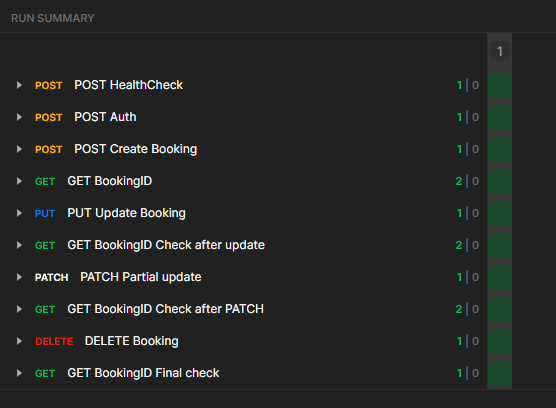

## Atiomation UI and API Test
A project for testing https://automationintesting.online website. I contains UI automation tests in Python and Selenium WebDriver and API tests in Postman.


## Prerequisites
Make sure that following python modules are installed:
- selenium,  
- unittest, 
- time, 
- faker,
- calendar,
- datetime,
- random.


## Recommended environment
Tested on given environment:
- Ubuntu 20.04.4,
- Python 3.8.10,
- Firefox 100.0.2,
- Geckodriver 31.0,
- Postman 9.18.


## Run

Clone repository
```bash
git clone
```
run command

```bash
python run_tests.py
```

## Results
- UI: Ran 5 tests in 73.885s
- API: 



## Additional comments
Test no. 5 for now is failing because there is a bug on the page.

## License
[MIT](https://choosealicense.com/licenses/mit/)
